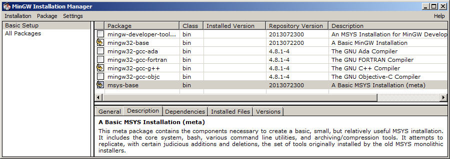
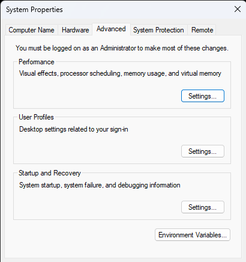
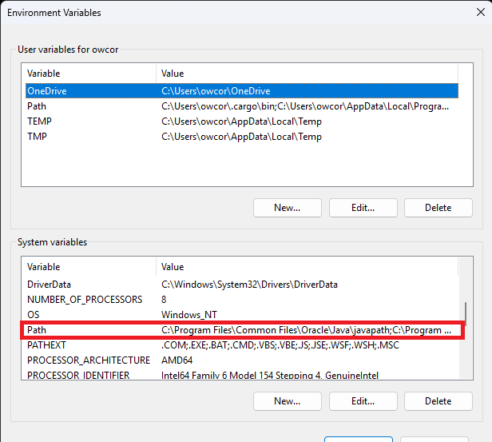
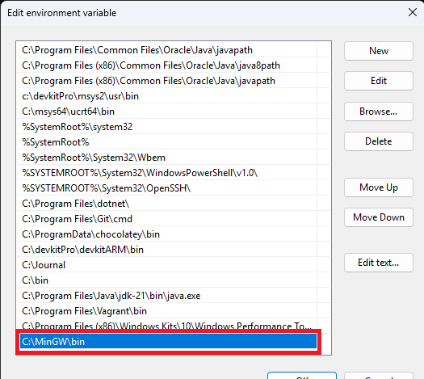
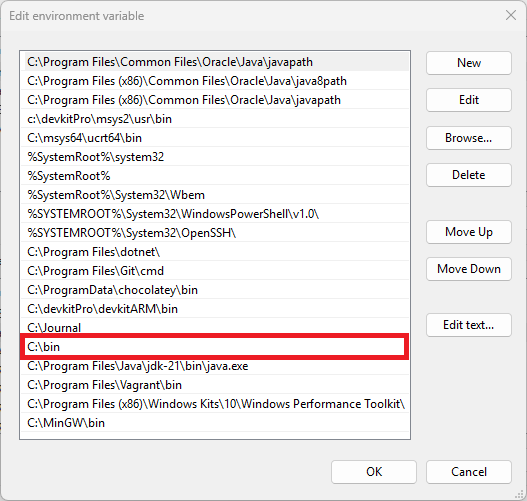

# All-In-One Compiler For Windows!
This program simplifies compiling files from the command line by automatically choosing which compiler to use. Compiling from CMD has never been so easy! compile is written in C++ and can be tweaked if needed.
# Setup
### MinGW Setup
Download the official minimalist .exe [from here.](https://sourceforge.net/projects/mingw/files/latest/download)  Proceed with the installation until you get an install screen similar to this:  
  
  

Then select these tools for installation:  
  
**mingw32-base**  
**mingw32-gcc-fortran**  
**mingw32-gcc-g++**  

Once done, hit install and wait!  

Once the installation is finished, go to the Windows search bar and type "Environment Variables" and select **Edit the system environment variables.**  
You should get a screen like this:  

  

Click the button that says **"Environment Variables..."** and a new window should appear. In the lower box which says "System variables", double click "Path":   
  
  
  
Press the **"New"** button and add this into the prompt: `C:\MinGW\bin`. It should look like this:  
    
  
  
***Make sure to hit the "Apply" button in the "System Properties" window!***  

### Rustc Setup
Download the correct rustup .exe for your machine from the [official download page.](https://www.rust-lang.org/tools/install) Run the program and choose the standard installation.  

### compile Setup
Download compile from the latest release. Once finished, place the executable in a folder and add the folder to the PATH (same process as adding minGW to PATH). For example, if you place it in C:\bin:  

  

Hit "Apply" and your done with the setup!

### Languages supported (from v1):
C++ (.cpp)  
C (.c)  
Rust (.rs)  
Fortran (.f, .for, .ftn, .f77, .f90, .f95, .f03, .f08, .f18)  

  
**More coming soon!**
